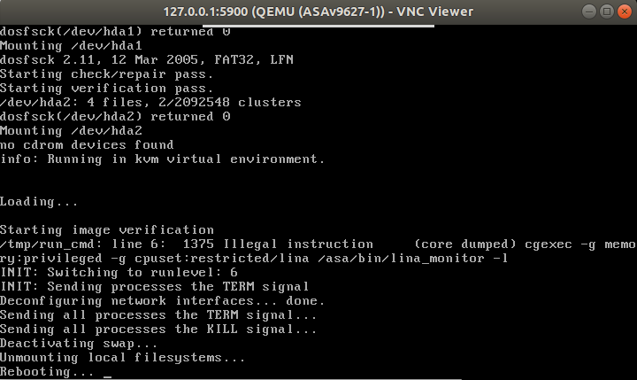

This documents some of the problems you may encounter and how to solve them.

# ASA crashes and reboot due to KVM

If you get the error: `/tmp/run_cmd: line 6: 1375 Illegal instruction (core 
dumped) cgexec -g memory:privileged -g cpuset:restricted/lina /
asa/bin/lina_monitor -l` when the ASA boots, it is due to the ASA using KVM
by default but your environment does not support it atm.

If you run it in VMWare, you can enable virtualization by switching off your 
VM and going to `VM > Settings`, then in Processors, tick 
`Virtualize Intel VT-x/EPT or AMD-V/RVI`.