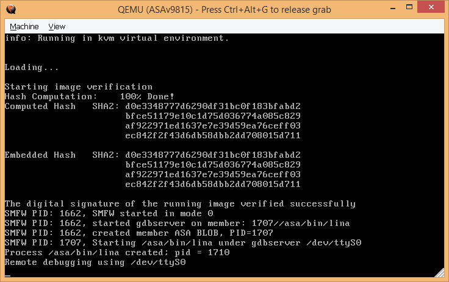

# Configuring a Cisco ASA test environment from ground zero

Sometimes, it is good to setup your own Cisco ASA environment so you can test 
your tools and compare the results with what you have in the wild. We describe 
here a way to setup it using GNS3 which is the standard way for creating virtual
networks with Cisco devices.

The installation of GNS3 is straightforward. You need to register on 
[GNS3 website](https://www.gns3.com/) in order to be able to [download the 
installer](https://www.gns3.com/software/download/windows). We used 
`GNS3-1.5.1-all-in-one.exe` in this tutorial but you can use any newer version.
It is free and you only need to register. There is nothing special to do during 
installation.

We detail the procedure using a Windows host and a Linux VM/VMWare and
ASAv 9.8.1(5). We do the following steps:

* GNS3 emulator setup
* New ASA internal configuration using CLI
* Importing symbols for new target
* Enabling gdb and debugging

It should work with any other `asav*.qcow2` as well as with a Linux host only
or using VirtualBox or other Virtual Machine software though you may need to 
tweak things for having a working network.

We download `asav981-5.qcow2` from the Internet (Cisco official website or 
Google for it). We check its MD5 against Cisco website (if needed).

## Create an ASA firewall in GNS3

First we exit the wizard: `Setup Wizard > exit`

Then we create a Qemu VM for our ASA firewall (it is not by default in GNS3):

```
Edit > Preferences > QEMU > QEMU VMs > New
Name: ASAv9815
Leave unticked: This is a legacy ASA VM
```

Then you specify the path to QEMU:

```
Qemu binary: C:\program files\GNS3\qemu-2.4.0\qemu-system-x86_64w.exe (v2.4.0) 
(the 64-bit version should already be selected)
RAM: 2048 MB (The ASA may crash at boot if you only assign 1024MB, see section later)
```

Then you specify the disk image (equivalent of the CF card with a real 
hardware). We actually select the `asav981-5.qcow2` file here.

```
Disk image (hda) > New Image > Browse > asav981-5.qcow2 (You get that from the Internet) (Say "yes" to "Would you like to copy asav981-5.qcow2 to the default images directory")
```

Then click "Finish". The last step is to modify the configuration of the newly 
created firewall VM:

```
QEMU > Qemu VMs > ASAv9815 > Edit
```

In "General Settings":

```
select "Symbol > Browse" and select "asa" to change the firewall's icon.
Category: Security devices
```

In "Network":

```
Adapters: 4
```

In "Advanced Settings":

```
go to "Additional Settings > Options", change "-nographic" into "-cpu Haswell -smp 4,sockets=4,cores=1,threads=1"
And untick "Use as a linked base VM"
```

You should now have your ASA created :)

## Create the network and start the firewall

You can now drop as many ASA firewalls as you want in the GNS3 environment. 
Let's start with one though :) You can click on the "Browse Security Devices" 
icon on the left bar (circle with triangle and bar inside) and drag and drop the
"ASAv9815" device.

A right click on the newly firewall instance gives us some options:

```
configure: shows all the options we already defined. For now we keep going
Start: starts the firewall as if we unplug/replug the firewall.
Console: starts a console as if we use a serial cable with a real firewall. This console does not seem to work actually. That is why we removed "-nographic" previously.
```

Let's start the firewall with "Start". You should get GNU GRUB asking you to 
boot the firmware (`asa*.bin`) normally or with no configuration loaded. It does
not matter for this time as there is no configuration yet anyway but keep in 
mind that you can use the second option if you want to boot the ASA without any 
configuration. Let it boot, it should take a few minutes. It asks to reboot 
after the first boot. So we let it do its stuff. We finally get the Cisco CLI.

The idea is to quickly setup the IP and SSH so we can connect to it using SSH 
from our host or VM. Indeed the qemu interface doesn't allow us to copy/paste 
stuff which is a annoying. We won't have this problem anymore with SSH :)

Note that the config below is not secure but it will work for a testing 
environment:

<pre>
enable
config t

hostname ASAv-9815

interface GigabitEthernet 0/2
shutdown

interface GigabitEthernet 0/0
nameif outside
ip address 192.168.100.99 255.255.255.0
no shutdown

interface GigabitEthernet 0/1
nameif inside
ip address 192.168.200.99 255.255.255.0
no shutdown

ssh 0.0.0.0 0.0.0.0 inside
ssh 0.0.0.0 0.0.0.0 outside
crypto key generate rsa general-keys modulus 2048
username user password user privilege 15
aaa authentication ssh console LOCAL
ssh version 2
ssh scopy enable

write memory
</pre>

Note that for GNS3, the "GigabitEthernet 0/0" interface is interface 1 and 
"GigabitEthernet 0/1" interface is interface 2, because there is a 
"Management interface", see the "show version" command.

## Connect the router to your host / VM

Now close the qemu window. It stops the ASA firewall. You can create a network 
between your host or VM in GNS3. You can use the virtual network editor 
in VMWare to create a custom network (such as VMnet2 which is not used by 
default), setup a static IP for your VM and use this one in GNS3.

You can `Right Click on the ASAv9815 dropped icon > Properties` and note the 
console port (e.g. 2004).

So the only thing we need is a way to forward connections from the Linux VM NAT
network (192.168.5.0/24) to the host localhost port. We use netsh in an admin
prompt on our Windows 8.1 host:

We use the following command to setup the TCP forwarding:

```
C:\Windows\system32>netsh interface portproxy add v4tov4 listenport=12004 connectport=2004 connectaddress=127.0.0.1
```

Then we allow traffic to go through the external IP/port so it is available
from the Linux VM:

```
C:\Windows\system32>netsh advfirewall firewall add rule name=GNS3_12004 protocol=TCP dir=in localip=192.168.5.1 localport=12004 action=allow
Ok.
```

Then you can start both the ASA and the VM from GNS3. You should now be able 
to connect using SSH from the VM to the GNS3 ASA firewall.

## Working out a basic ASA config

We provide commands to configure an ASA in `asadbg/config/`.
We use `setup_anyconnect_asav.cfg`, `setup_ikev1_asav.cfg`, 
`setup_ikev2_asav.cfg`, `setup_snmp_asav.cfg` to input manually commands using
SSH. We end this by writing the following command to save the configuration.

```
ciscoasa# write memory
```

Now you can test that everything works correctly using:

To test SNMP, we use:

```
$ snmpget -v 2c -c public 192.168.100.99 iso.3.6.1.2.1.1.1.0
iso.3.6.1.2.1.1.1.0 = STRING: "Cisco Adaptive Security Appliance Version 9.8(1)5"
```

To test IKEv1, we use:

```
# ike-scan 192.168.100.99 -M
Starting ike-scan 1.9 with 1 hosts (http://www.nta-monitor.com/tools/ike-scan/)
192.168.100.99	Main Mode Handshake returned
	HDR=(CKY-R=80ddfe9e7e139a54)
	SA=(Enc=3DES Hash=SHA1 Group=2:modp1024 Auth=PSK LifeType=Seconds LifeDuration=28800)
	VID=4048b7d56ebce88525e7de7f00d6c2d3c0000000 (IKE Fragmentation)

Ending ike-scan 1.9: 1 hosts scanned in 0.023 seconds (42.68 hosts/sec).  1 returned handshake; 0 returned notify
```

To test IKEv2, we use:

```
# ike-scan 192.168.100.99 -M -2
Starting ike-scan 1.9 with 1 hosts (http://www.nta-monitor.com/tools/ike-scan/)
192.168.100.99	IKEv2 SA_INIT Handshake returned
	HDR=(CKY-R=0e78fb3f954516bb, IKEv2)
	SA=(Encr=DES Prf=HMAC_SHA1 Integ=HMAC_SHA1_96 DH_Group=2:modp1024)
	KeyExchange(132 bytes)
	Nonce(64 bytes)
	VendorID(19 bytes)
	VendorID(55 bytes)
	CertificateRequest(21 bytes)
	Notification(4 bytes)
	VendorID(16 bytes)

Ending ike-scan 1.9: 1 hosts scanned in 0.021 seconds (47.56 hosts/sec).  1 returned handshake; 0 returned notify
```

To test WebVPN, we simply access: `https://192.168.100.99/`

## Extracting the firmware

We first start by extracting the original firmware:

```
# cd /home/user/fw/
# unpack_repack_qcow2.sh -i asav981-5.qcow2 -u
[unpack_repack_qcow2] Using input qcow2 file: asav981-5.qcow2
[unpack_repack_qcow2] Using template qcow2 file: asav981-5.qcow2
[unpack_repack_qcow2] Using output qcow2 file: /home/user/fw/asav981-5-repacked.qcow2
[unpack_repack_qcow2] Command line: -f 
[unpack_repack_qcow2] extract_one: asav981-5.qcow2
[unpack_repack_qcow2] Mounted /dev/nbd01 to /home/user/mnt/qcow2
[unpack_repack_qcow2] Copied asa981-5-smp-k8.bin to /home/user/fw/bin/asav981-5.qcow2
[unpack_repack_qcow2] Unmounted /home/user/mnt/qcow2
[unpack_repack_bin] Single firmware detected
[unpack_repack_bin] extract_one: asav981-5.qcow2

DECIMAL       HEXADECIMAL     DESCRIPTION
--------------------------------------------------------------------------------
75264         0x12600         SHA256 hash constants, little endian
133120        0x20800         Microsoft executable, portable (PE)
149183        0x246BF         gzip compressed data, maximum compression, from Unix, last modified: 2017-01-31 13:18:04
3677888       0x381EC0        gzip compressed data, has original file name: "rootfs.img", from Unix, last modified: 2017-06-23 13:26:17
3798108       0x39F45C        MySQL MISAM compressed data file Version 5
21825388      0x14D076C       MPEG transport stream data
23787190      0x16AF6B6       MySQL MISAM compressed data file Version 6
73512497      0x461B631       Cisco IOS experimental microcode, for "%q"
96259759      0x5BCCEAF       Zip archive data, at least v2.0 to extract, name: com/cisco/webvpn/csvrjavaloader64.dll

[unpack_repack_bin] Extracted firmware to /home/user/fw/bin/_asav981-5.qcow2.extracted
[unpack_repack_bin] Firmware uses regular rootfs/ dir
[unpack_repack_bin] Extracting /home/user/fw/bin/_asav981-5.qcow2.extracted/rootfs/rootfs.img into /home/user/fw/bin/_asav981-5.qcow2.extracted/rootfs
458764 blocks
[unpack_repack_bin] Keeping rootfs
[unpack_repack_bin] Deleting "/home/user/fw/bin/_asav981-5.qcow2.extracted/rootfs.img"
[unpack_repack_bin] Deleting "/home/user/fw/bin/_asav981-5.qcow2.extracted/246BF"
[unpack_repack_bin] Deleting "/home/user/fw/bin/_asav981-5.qcow2.extracted/5BCCEAF.zip"
```

## Importing mitigations and symbols

We go into the directory where the firmware was reviously extracted:

```
$ cd /home/user/fw/
```

We import the mitigations for this new version

```
$ info.sh --save-result --db-name /home/user/asatools/asadbg/asadb.json 
[info] Adding new element:
{'RELRO': False, 'imagebase': 93824992231424, 'fw': 'asav981-5.qcow2', 'PIE': True, 'ASLR': True, 'glibc_version': '2.18', 'arch': 64, 'version': '9.8.1.5', 'Canary': False, 'exported_symbols': False, 'NX': True, 'stripped': False, 'heap_alloc': 'ptmalloc 2.x'}
```

Now we take `lina` from 
`/home/user/fw/bin/_asav981-5.qcow2.extracted/asa/bin/lina` and analyze it from
our Windows machine:

We do the initial analysis:

```
C:\idahunt>idahunt.py --verbose --inputdir "C:\linabins" --analyse --filter "filters\ciscoasa.py -m 9815
-a gns3"
[idahunt] IDA32 = C:\Program Files (x86)\IDA 6.95\idaq.exe
[idahunt] IDA64 = C:\Program Files (x86)\IDA 6.95\idaq64.exe
[idahunt] ANALYSING FILES
[idahunt] Analysing C:\linabins\asav981-5.qcow2\lina
[idahunt] C:\Program Files (x86)\IDA 6.95\idaq64.exe -B -LC:\linabins\asav981-5.qcow2\lina.log C:\linabins\asav981-5.qcow2\lina
[idahunt] Waiting on remaining 1 IDA instances
```

We rename stuff in IDA:

```
C:\idahunt>idahunt.py --verbose --inputdir "C:\linabins" --scripts C:\asadbg\asadbg_rename.py --filter "filters\ciscoasa.py -m 9815 -a gns3"
[idahunt] IDA32 = C:\Program Files (x86)\IDA 6.95\idaq.exe
[idahunt] IDA64 = C:\Program Files (x86)\IDA 6.95\idaq64.exe
[idahunt] EXECUTE SCRIPTS
[idahunt] Executing script C:\asadbg\asadbg_rename.py for C:\linabins\asav981-5.qcow2\lina
[idahunt] C:\Program Files (x86)\IDA 6.95\idaq64.exe -A -SC:\asadbg\asadbg_rename.py -LC:\linabins\asav981-5.qcow2\lina.log C:\linabins\asav981-5.qcow2\lina.i64
[idahunt] Waiting on remaining 0 IDA instances
```

We import the symbols in our database:

```
C:\idahunt>idahunt.py --verbose --inputdir "C:\linabins" --scripts C:\asadbg\asadbg_hunt.py --filter "filters\ciscoasa.py -m 9815 -a gns3"
[idahunt] IDA32 = C:\Program Files (x86)\IDA 6.95\idaq.exe
[idahunt] IDA64 = C:\Program Files (x86)\IDA 6.95\idaq64.exe
[idahunt] EXECUTE SCRIPTS
[idahunt] Executing script C:\asadbg\asadbg_hunt.py for C:\linabins\asav981-5.qcow2\lina
[idahunt] C:\Program Files (x86)\IDA 6.95\idaq64.exe -A -SC:\asadbg\asadbg_hunt.py -LC:\linabins\asav981-5.qcow2\lina.log C:\linabins\asav981-5.qcow2\lina.i64
```

## Enabling gdb in firmware

Here we need to copy our image from GNS3 (e.g. 
`C:\Users\<user>\GNS3\images\QEMU\asav981-5.qcow2`) as we want to keep the
internal ASA configuration that we previously made.

We enable gdb, disable ASLR and inject a gdbserver as this firmware does not
have it:

```
# unpack_repack_qcow2.sh -i asav981-5.qcow2 -g -A --inject-gdb
[unpack_repack_qcow2] Using input qcow2 file: asav981-5.qcow2
[unpack_repack_qcow2] Using template qcow2 file: asav981-5.qcow2
[unpack_repack_qcow2] Using output qcow2 file: /home/user/cisco/firmware/asav981-5-repacked.qcow2
[unpack_repack_qcow2] Command line: -f  -g -A -m
[unpack_repack_qcow2] extract_repack_one: asav981-5.qcow2
[unpack_repack_qcow2] Mounted /dev/nbd01 to /home/user/mnt/qcow2
[unpack_repack_qcow2] Copied asa981-5-smp-k8.bin to /home/user/cisco/firmware/bin/asav981-5.qcow2
[unpack_repack_qcow2] Unmounted /home/user/mnt/qcow2
[unpack_repack_bin] Single firmware detected
[unpack_repack_bin] unpack_one: asav981-5.qcow2
[bin] Unpacking...
[bin] Writing /home/user/cisco/firmware/bin/asav981-5-initrd-original.gz (100977114 bytes)...
[bin] Could not find Direct booting from string
[bin] Probably handling a 64-bit firmware...
[bin] unpack: Writing /home/user/cisco/firmware/bin/asav981-5-vmlinuz (3544768 bytes)...
458764 blocks
[unpack_repack_bin] modify_one: asav981-5.qcow2
[unpack_repack_bin] DISABLE ASLR
[unpack_repack_bin] ENABLE GDB
[unpack_repack_bin] FREE SPACE IN .BIN
[unpack_repack_bin] INJECT OTHER GDB
[unpack_repack_bin] repack_one: asav981-5.qcow2
446277 blocks
[bin] Repacking...
[bin] repack: Writing /home/user/cisco/firmware/bin/asav981-5-repacked-gdbserver.qcow2 (104749056 bytes)...
[unpack_repack_bin] MD5: c31158f529339f7d454ec2e8e16ec751  /home/user/cisco/firmware/bin/asav981-5-repacked-gdbserver.qcow2
[unpack_repack_bin] CLEANUP
[unpack_repack_qcow2] Mounted /dev/nbd01 to /home/user/mnt/qcow2
[unpack_repack_qcow2] Moved modified .bin inside of /home/user/cisco/firmware/asav981-5-repacked.qcow2
[unpack_repack_qcow2] Unmounted /home/user/mnt/qcow2
```

```
# mv asav981-5-repacked.qcow2 asav981-5-gdb-noaslr.qcow2
```

Now we can copy back this file into GNS3 and modify the link to the `asav*.qcow2`
from our ASAv9815 instance using:

```
Right click > Configure then HDD > Disk image > Browse > Select asav981-5-gdb-noaslr.qcow2
```

After booting the emulator, we get the following:



## Debugging

To debug, we define add this to `asadbg.cfg`:

```
[asav9815]
version=9815
arch=gns3
rootfs_path=/home/user/fw/_asav981-5.qcow2.extracted/rootfs
gns3_port=12004
attach_gdb=yes
```

Now we can debug it:

```
asadbg$ ./asadbg.py --name asav9815
[asadbg] Using config file: /home/user/asatools/asadbg/asadbg.cfg
[asadbg] Found section: 'asav9815' in config
[asadbg] Using gdb: '/usr/bin/gdb'
[asadbg] Using db file: '/home/user/asatools/asadbg/asadb.json'
[asadbg] Using architecture: gns3
[asadbg] Trying lina: /home/user/fw/_asav981-5.qcow2.extracted/rootfs/asa/bin/lina
[asadbg] Going to debug...
[asadbg] Using GNS3 emulator 192.168.5.1:12004
[asadbg] Starting gdb now...
[gdbinit_9815] Configuring paths...
[gdbinit_9815] Disabling pagination...
[gdbinit_9815] Connecting over TCP/IP...
0x00007ffff7ddd190 in ?? () from /home/user/fw/_asav981-5.qcow2.extracted/rootfs/lib64/ld-linux-x86-64.so.2
[gdbinit_9815] Connected.
[gdbinit_9815] Watchdog disabled
[helper] loaded
[libptmalloc] mpcallback registered as callback
[libdlmalloc] mpcallback registered as callback
[gdbinit_9815] heap debugging plugins loaded
[ikev2] loaded
[ikev1] loaded
[gdbinit_9815] Additional gdb scripts loaded
[gdbinit_9815] Done.
(gdb) c
Continuing.
warning: Could not load shared library symbols for linux-vdso.so.1.
Do you need "set solib-search-path" or "set sysroot"?
```